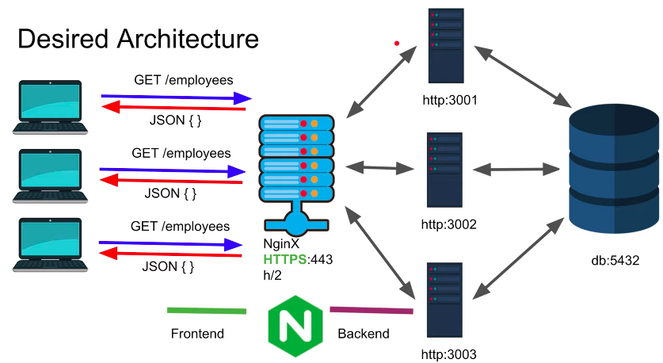

## Nginx Introduction

#### What is Nginx?
######*Nginx acts as a web-server and a proxy both*
* Web Server : [ Serves Web content ]
* Proxy : [ Load Balancing , Backend Routing, Caching ]



#### Layer 4 and Layer 7 proxying in Nginx
* Nginx can operate in Layer 7 (http) or Layer 4 (tcp)
* Using stream context it becomes layer 4 proxy
* Using http context it becomes layer 7 proxy

##Learn by example !
#### Index
* Install Nginx (Mac)
* Nginx as a Web Server
* Nginx as a Layer 7 Proxy
 * Proxy to 4 backend Node JS Services (docker)
 * Split load to multiple backends (app1/app2)
 * Block certain requests (/admin)
* Nginx as a Layer 4 Proxy
* Enable https on Nginx (lets encrypt)
* Enable TLS (1.3) on Nginx
* Enable HTTP/2 on Nginx

## Install Nginx
```
brew install nginx
cd /usr/local/etc/nginx
sudo nginx       (To run nginx)
sudo nginx -s stop    (stop nginx)
sudo nginx -s reload  (reload nginx)
vim nginx.conf  (To see nginx.conf)
                 ( We are going to start from scratch )
rm nginx.conf    (delete nginx.conf)
vim nginx.conf  (To create a new nginx.conf file) 

```

#### Nginx configuration nginx.conf

```
# We want to make an nginx static web-server
http {
	server{
		listen 8080;   		 
	}
}    

events { }
# Now run nginx with sudo nginx and 
# you have set up a server on port 8080 and go to  
# localhost:8080. 

# You will see a default nginx page.
# In the nest task we will make our own page
```

* Now on your desktop make a folder and name it "nginx" for this tutorial.

```
mkdir nginx
nvim index.html

# Now in index.html 
<html>               
        <body>        
        <h3> Hello this is nginx with my own content </h3>        
        </body>        
</html> 

```

* Now it's time to edit the config

```
http {
        server{
                listen 8080;
                root /Users/kartikrawat61/desktop/github/nginx/;
        }
}

events { }


```
* Now save this config and reload nginx and go to localhost:8080. 
* Now you will see your static web-service!

#### Now we will add different locations (let's say sites to the config)

In your nginx tutorial direcory run : 

```
mkdir site1
mkdir site2
cd site1
nvim index.html
 #(then in index.html paste this html code and save)
<html>
<body>
This is site 1
</body>
</html>

cd ..
cd site2
 #(then in index.html paste this html code and save)
<html>
<body>
This is site 2
</body>
</html>

```
* Now reload and goto localhost:8080/site1 or site2 and see!


* Now we are adding locations. In your downloads folder make an images folder and put an image in it. Now we will use the location directive to get a basic idea. 

######Nginx config :

```
http {
        server{
                listen 8080;
                root /Users/kartikrawat61/desktop/github/nginx/;
                                 
                location /images{
                        root /Users/kartikrawat61/downloads/;   
                }
        }
}

events { }

```  
* Now when you go to http://localhost:8080/images you will get the 403 FORBIDDEN ERROR. But when you specify the name of the image in the url :

	* For example : http://localhost:8080/images/NYC.jpg

	* Then you will see the image stored in your local system!


* What what if you want nginx to stop users from accessing a file with a certain extension? 
* For example lets stop the user from accessing files with .jpg extension

######Nginx config :
```
http {
        server{
                listen 8080;
                root /Users/kartikrawat61/desktop/github/nginx;

                location /images{
                        root /Users/kartikrawat61/downloads/;
                }

                location ~ .jpg$ {
                        return 403;
                }
        }
}

events { }

```
* And now if you go to http://localhost:8080/images/image_name.jpg you will see the 403 forbidden error!


## Proxy Pass

You can add as many servers you want in the nginx config. So let's say I define a server listening at port 8888. Now we will proxy it to forward the request to 8080. (Which is called aliasing)

###### Nginx conig:

```
http {
        server {
                listen 8080;
                root /Users/kartikrawat61/desktop/github/nginx;

                location /images{
                        root /Users/kartikrawat61/downloads/;
                }

                location ~ .jpg$ {

                        return 403;
                }
        }

        server {
                listen 8888;

                location / {
                        proxy_pass http://localhost:8080;
                }

        }
}

events { }

```

* Now you will see port 8080's content when you go to 8888!

**You can also proxy_pass towards the image folder you made before.**

###### Nginx conig:

```
http {
        server {
                listen 8080;
                root /Users/kartikrawat61/desktop/github/nginx;

                location /images{
                        root /Users/kartikrawat61/downloads/;
                }

                location ~ .jpg$ {

                        return 403;
                }
        }

        server {
                listen 8888;

                location / {
                        proxy_pass http://localhost:8080;
                }

                location /img {
                        proxy_pass http://localhost:8080/images/;
                }
        }
}

events { }

```

* Now if you go to the url **http://localhost:8888/img/image_name.png** you will be able to see the image saved in your local system! But of course you will see error 403 forbidden for every .jpg file because you have specified that for port 8080 and port 8888 is basically rerouting to that.

## Nginx as a Layer 7 proxy 

**Let's proxy nginx to 4 node js services !**

* Let's start 4 node js services. 
 * In your desktop run the following commands :
 * `mkdir nginx_servers`
 * `npm init -y`
 * `npm i express`
 * `touch app.js`
 * Now in app.js paste the following code and run `node app.js`
 
```
const express = require('express');
const app1 = express();
const app2 = express();
const app3 = express();
const app4 = express();

app1.get('/',(req,res)=>{
	res.json({msg:'Setup Aok port 5000'})
})
app1.get('/admin',(req,res)=>{
	res.json({msg:'Serving admin application'})
})

app2.get('/',(req,res)=>{
        res.json({msg:'Setup Aok port 5001'})
})

app3.get('/',(req,res)=>{
        res.json({msg:'Setup Aok port 5002'})
})

app4.get('/',(req,res)=>{
        res.json({msg:'Setup Aok port 5003'})
})

app1.listen(5000,()=> console.log('Server setup on port : 5000'))
app2.listen(5001,()=> console.log('Server setup on port : 5001'))
app3.listen(5002,()=> console.log('Server setup on port : 5002'))
app4.listen(5003,()=> console.log('Server setup on port : 5003'))

``` 

**Now we want nginx to listen on port 8080 and load-balance the above 4 applications**

###### Nginx conig:

```
http {
        upstream allbackend {
                # This will be Round Robin by default!
                server 127.0.0.1:5000;
                server 127.0.0.1:5001;
                server 127.0.0.1:5002;
                server 127.0.0.1:5003;
        }
        server {
                listen 8080;
                location /{
                        proxy_pass http://allbackend/;
                }
        }
}
events{}

```

* **Now when you go to localhost:8080 you will be hitting the servers one by one! (round robin manner)**
* **So basically in this case the browser has established one tcp connection with nginx and nginx has established 4 tcp connections with the 4 node servers respectively**
* **One popular load balancing algorithm is `ip_hash`. It basically hashes the ip address of the client and sticks to one single server. That means all requests coming from one singular client will hit only one server.** 

### **Now let's define ports 5000,5001 as app1backend and 5002,5003 as app2backend.** 

##### nginx conf :

```
http {
        upstream allbackend {
                # This will be Round Robin by default!
                server 127.0.0.1:5000;
                server 127.0.0.1:5001;
                server 127.0.0.1:5002;
                server 127.0.0.1:5003;
        }

        upstream app1backend {
                server 127.0.0.1:5000;
                server 127.0.0.1:5001;
        }

        upstream app2backend {
                server 127.0.0.1:5002;
                server 127.0.0.1:5003;
        }
        server {
                listen 8080;
                location / {
                        proxy_pass http://allbackend/;
                }

                location /app1 {
                        proxy_pass http://app1backend/;
                }

                location /app2 {
                        proxy_pass http://app2backend/;
                }
        }

}
events{}

```

* **We don't want outsiders to view the /admin endpoint. How to stop that?**

###### Nginx conf

```
http {
        upstream allbackend {
                # This will be Round Robin by default!
                server 127.0.0.1:5000;
                server 127.0.0.1:5001;
                server 127.0.0.1:5002;
                server 127.0.0.1:5003;
        }

        upstream app1backend {
                server 127.0.0.1:5000;
                server 127.0.0.1:5001;
        }

        upstream app2backend {
                server 127.0.0.1:5002;
                server 127.0.0.1:5003;
        }
        server {
                listen 8080;
                location / {
                        proxy_pass http://allbackend/;
                }

                location /app1 {
                        proxy_pass http://app1backend/;
                }

                location /app2 {
                        proxy_pass http://app2backend/;
                }
                location /admin {
                        return 403;
                }
        }

}
events{}

```

## Layer 4
* You notice your changing server ports when you refresh when you use http (layer 7) but this doesn't happen with layer 4 because the connection isn't closed after a request when layer 4 is used! Because it's the browser who decides which tcp connection it wants to use. 

##### nginx config

```
stream {
        upstream allbackend {
                # This will be Round Robin by default!
                server 127.0.0.1:5000;
                server 127.0.0.1:5001;
                server 127.0.0.1:5002;
                server 127.0.0.1:5003;
        }
        server {
                listen 8080;
                proxy_pass allbackend;

        }
}
events{}

```

##### Now let's switch back to our layer 7 (http) nginx configuration.

## Enable https on nginx (lets encrypt)
**on mac** : `brew install letsencrypt`

*You can letsencrypt for a SSL certificate*
* First stop nginx `nginx -s stop`
* Run `sudo certbot certonly --standalone`

*TODO : Add more instructions. (You can use google for SSL basically you need an SSL public and private key on your system)*

######Nginx config:
```
http {
        upstream allbackend {
                # This will be Round Robin by default!
                server 127.0.0.1:5000;
                server 127.0.0.1:5001;
                server 127.0.0.1:5002;
                server 127.0.0.1:5003;
        }

        upstream app1backend {
                server 127.0.0.1:5000;
                server 127.0.0.1:5001;
        }

        upstream app2backend {
                server 127.0.0.1:5002;
                server 127.0.0.1:5003;
        }
        server {
                listen 8080;
                listen 443 ssl;
                
                ssl_certificate /path/to/public/ssl/key
                
                ssl_certificate_key /path/to/private/ssl/key
                
                location / {
                        proxy_pass http://allbackend/;
                }

                location /app1 {
                        proxy_pass http://app1backend/;
                }

                location /app2 {
                        proxy_pass http://app2backend/;
                }
                location /admin {
                        return 403;
                }
        }

}
events{}
```


 


